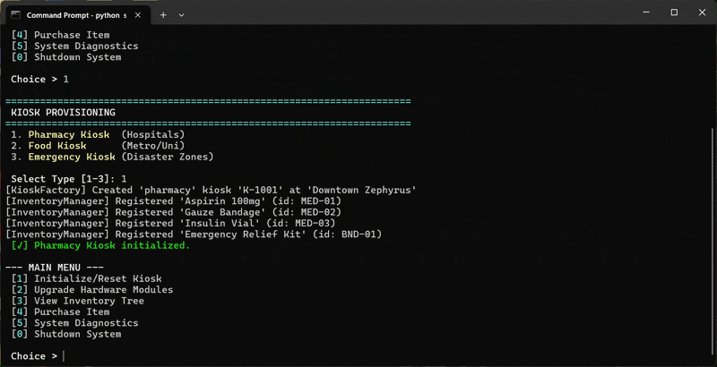

# <p align="center">Aura Retail OS</p>

<p align="center">
  
  
  
</p>

---

## 🌆 Project Vision
**Aura Retail OS** is a modular, high-performance platform designed to revolutionize autonomous retail in the smart city of **Zephyrus**. Built on robust Object-Oriented principles, it decouples high-level business logic from low-level hardware and payment implementations, ensuring scalability across hospitals, metro stations, and disaster zones.

---

## 🚀 Visual Demo
To see the system in action, watch the interactive simulation below:

<p align="center">
  
</p>


---

## 🏗️ System Architecture
The project is organized into a clean, subsystem-based hierarchy to ensure low coupling and high cohesion:

- **`core/`**: Orchestration logic (Kiosk base classes, Factory, Central Registry).
- **`inventory/`**: Product management, nested bundles (Composite Pattern), and access security (Proxy).
- **`payment/`**: Unified payment interface and third-party adapters (Adapter Pattern).
- **`hardware/`**: Hardware abstraction (Bridge) and modular upgrades (Decorator).
- **`persistence/`**: System state serialization (JSON/CSV).

---

## 🧩 Implemented Design Patterns

| Pattern | Purpose in Aura Retail OS | Subsystem |
| :--- | :--- | :--- |
| 🏗️ **Composite** | Recursive pricing and availability for nested product bundles. | `inventory` |
| 🔌 **Adapter** | Unifying heterogeneous payment APIs (UPI, CC, Wallet). | `payment` |
| 🚪 **Facade** | Simplifying complex subsystem interactions into a single interface. | `core` |
| 🏭 **Factory** | Consistent provisioning of kiosks with compatible hardware. | `core` |
| 🌉 **Bridge** | Decoupling dispensing logic from physical motor implementations. | `hardware` |
| 🎀 **Decorator** | Dynamically attaching optional modules (Refrigeration, Solar). | `hardware` |
| 👑 **Singleton** | Global configuration and system status registry. | `core` |
| 🛡️ **Proxy** | Secure, logged access to sensitive inventory records. | `inventory` |

---

## 🛠️ Getting Started

### Prerequisites
- **Python 3.8+**
- A terminal with UTF-8 support (Standard for Windows Terminal / VS Code).

### Installation & Execution
1. **Clone the repository.**
2. **Launch the Interactive CLI**:
```bash
python simulation.py
```

### 🧪 Testing the System
A comprehensive [TESTING_GUIDE.md](file:///c:/Users/khera/Downloads/files/TESTING_GUIDE.md) is provided to help you verify every design pattern through the interactive menu.

---

## 👥 Team & Responsibilities
For a detailed breakdown of which member implemented which subsystem, please refer to:
[MEMBER_RESPONSIBILITIES.md](file:///c:/Users/khera/Downloads/files/MEMBER_RESPONSIBILITIES.md)

---
<p align="center">
  <i>Developed for IT620 — Object Oriented Programming | Group 28</i>
</p>
